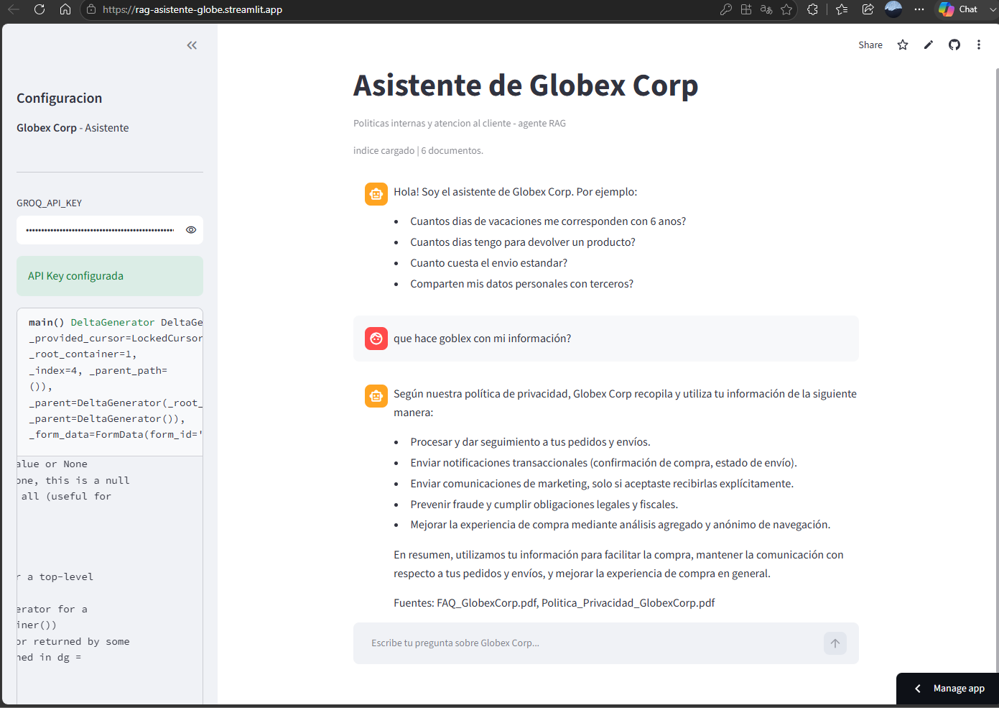

# 🤖 Asistente de Globex Corp — Agente RAG

Proyecto desarrollado para el **Challenge Alura Agente**: un agente de
Inteligencia Artificial basado en **RAG (Retrieval Augmented Generation)**
capaz de responder preguntas en lenguaje natural sobre los documentos
internos y de atención al cliente de **Globex Corp**, una tienda online ficticia.

🌐 **Demo en vivo:** [rag-asistente-globe.streamlit.app](https://rag-asistente-globe.streamlit.app)

---

## 📌 Descripción general

**Globex Corp** es una tienda online (e-commerce) ficticia. El agente responde
preguntas tanto **internas de RH** (vacaciones, viáticos, trabajo remoto, ética)
como **de cara al cliente** (privacidad, reembolsos, envíos, términos y condiciones,
preguntas frecuentes).

Todas las respuestas se generan con un modelo de lenguaje (LLM) fundamentadas
**exclusivamente** en el contenido de los 6 documentos PDF cargados, evitando
respuestas inventadas ("alucinaciones").

---

## 🏗️ Arquitectura de la solución

```
6 documentos PDF (documentos/)
        │
        ▼ PyPDFLoader
        │
        ▼ RecursiveCharacterTextSplitter (chunk_size=1200, overlap=300)
        │
        ▼ HuggingFaceEmbeddings (all-MiniLM-L6-v2)
        │
        ▼ Vector Store FAISS (índice local)
        │
        ▼ Retriever (top-k=4)
        │
        ├── Historial de conversación (LangChain LCEL)
        │
        ▼ ChatGroq — llama-3.1-8b-instant (gratuito)
        │
        ▼ Interfaz Streamlit (chat interactivo + sidebar)
```

| Componente | Tecnología |
|---|---|
| Orquestación RAG | LangChain LCEL |
| Vector Store | FAISS (local) |
| Embeddings | HuggingFace `all-MiniLM-L6-v2` |
| LLM | `llama-3.1-8b-instant` vía Groq Cloud |
| Interfaz | Streamlit |
| Procesamiento de PDF | `PyPDFLoader` + `RecursiveCharacterTextSplitter` |
| Generación de documentos | `reportlab` |
| Deploy | Streamlit Community Cloud |

---

## 📂 Estructura del repositorio

```
asistente-politicas-globex/
├── app.py                              # App Streamlit con cadena RAG (LCEL)
├── generar_pdf_dummy.py                # Genera el manual de RH (PDF)
├── generar_documentos_ecommerce.py     # Genera los 5 documentos de e-commerce (PDF)
├── validar_agente.py                   # Batería de pruebas automáticas del agente
├── colab_desarrollo.ipynb              # Notebook para desarrollar en Google Colab
├── prueba_agente_notebook.ipynb        # Notebook de prueba de la lógica RAG
├── documentos/
│   ├── Manual_Politicas_GlobexCorp.pdf
│   ├── Politica_Privacidad_GlobexCorp.pdf
│   ├── Politica_Reembolsos_Devoluciones_GlobexCorp.pdf
│   ├── FAQ_GlobexCorp.pdf
│   ├── Guia_Envios_Entregas_GlobexCorp.pdf
│   └── Terminos_Condiciones_GlobexCorp.pdf
├── requirements.txt
├── .env.example
├── .gitignore
├── setup_local.sh                      # Setup automático Linux/Mac
├── setup_local.ps1                     # Setup automático Windows
└── deploy/
    ├── deploy_oci.sh                   # Script de deploy en OCI Compute
    ├── asistente_globex.service        # Servicio systemd para OCI
    └── DEPLOY_OCI.md                   # Guía paso a paso OCI
```

---

## 🚀 Cómo ejecutar el proyecto localmente

### Requisitos
- Python 3.10 o superior
- GROQ_API_KEY gratuita: [console.groq.com/keys](https://console.groq.com/keys)

### Pasos

```bash
# 1. Clonar el repositorio
git clone https://github.com/TU_USUARIO/asistente-politicas-globex.git
cd asistente-politicas-globex

# 2. Crear entorno virtual
python3 -m venv venv
source venv/bin/activate        # Windows: venv\Scripts\activate

# 3. Instalar dependencias
pip install -r requirements.txt

# 4. Generar los documentos PDF
python generar_pdf_dummy.py
python generar_documentos_ecommerce.py

# 5. Configurar API key
cp .env.example .env
# Editar .env y agregar tu GROQ_API_KEY

# 6. Ejecutar
streamlit run app.py
```

La app abre en `http://localhost:8501`.

### Alternativa — Google Colab

Abre `colab_desarrollo.ipynb` en [colab.research.google.com](https://colab.research.google.com),
sube los archivos del proyecto y sigue las celdas en orden. Incluye celda
para levantar Streamlit con URL pública vía `pyngrok`.

---

## 💬 Ejemplos de preguntas y respuestas

| Pregunta | Respuesta del agente |
|---|---|
| ¿Cuántos días de vacaciones con 6 años de antigüedad? | **20 días hábiles** al año (sección 1.1 del manual de RH) |
| ¿Cuántos días tengo para devolver un producto? | **30 días calendario** desde la entrega, sin justificar motivo |
| ¿Cuánto cuesta el envío estándar a zona urbana? | **USD 4.99**, entrega en 3-5 días hábiles; gratis en compras > USD 60 |
| ¿Qué pasa si recibo un producto dañado? | Reportar en **48 horas** desde "Mi Cuenta > Reportar problema"; se reemplaza o reembolsa sin costo |
| ¿Comparten mis datos personales con terceros? | Solo con mensajería y pasarela de pago; **nunca se venden** a terceros |
| ¿Cómo funciona el canal de denuncias internas? | **Línea Ética Globex**, canal anónimo disponible 24/7 |
| ¿Cuál es la política de la empresa X? (fuera de alcance) | El agente indica que **no tiene esa información** y sugiere contactar soporte |

---

## ☁️ Evidencia del Deploy

La aplicación está desplegada en **Streamlit Community Cloud** y accesible
públicamente en todo momento:

🌐 **URL:** [https://rag-asistente-globe.streamlit.app](https://rag-asistente-globe.streamlit.app)



> Para el deploy en OCI Compute, consultar la guía completa en [`deploy/DEPLOY_OCI.md`](deploy/DEPLOY_OCI.md).

---

## 🧠 Decisiones técnicas

- **FAISS local** en lugar de un vector store administrado: mantiene el proyecto simple, reproducible y 100% gratuito.
- **LangChain LCEL** (LangChain Expression Language) en lugar de `ConversationalRetrievalChain`: es la API moderna recomendada, más estable entre versiones y sin dependencias deprecadas.
- **llama-3.1-8b-instant en Groq Cloud**: gratuito, baja latencia (~1-2 seg por respuesta), ideal para demos.
- **Historial explícito** en `st.session_state`: permite preguntas de seguimiento como *"¿y con 10 años de antigüedad?"* manteniendo el contexto entre turnos.
- **Prompt restrictivo**: el sistema instruye al modelo a responder solo con base en el contexto recuperado y a admitir cuando no tiene la información, reduciendo alucinaciones.
- **6 documentos PDF**: cubren tanto el área interna de RH como la atención al cliente de e-commerce, haciendo al agente útil para dos perfiles distintos de usuario.

---

## 📄 Licencia

Proyecto desarrollado con fines educativos para el **Challenge Alura Agente** (Alura LATAM / Oracle Next Education).
Los datos de "Globex Corp" son completamente ficticios.
